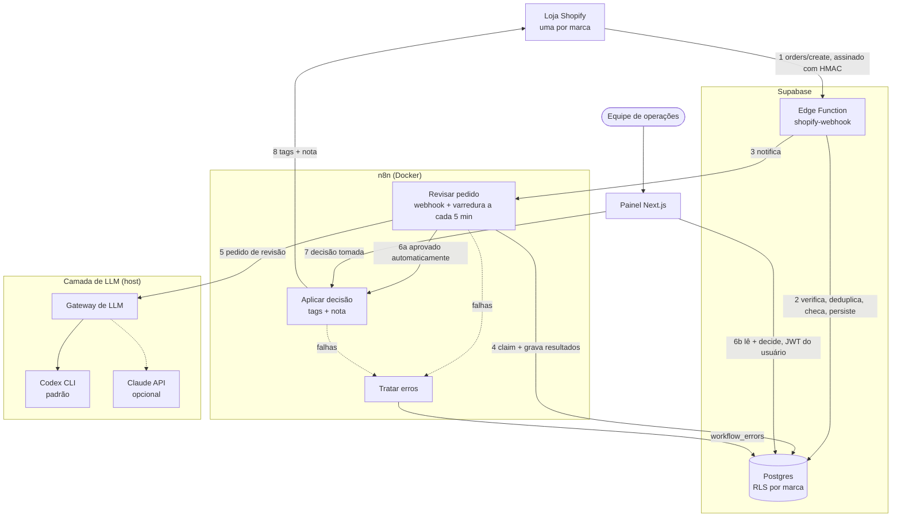
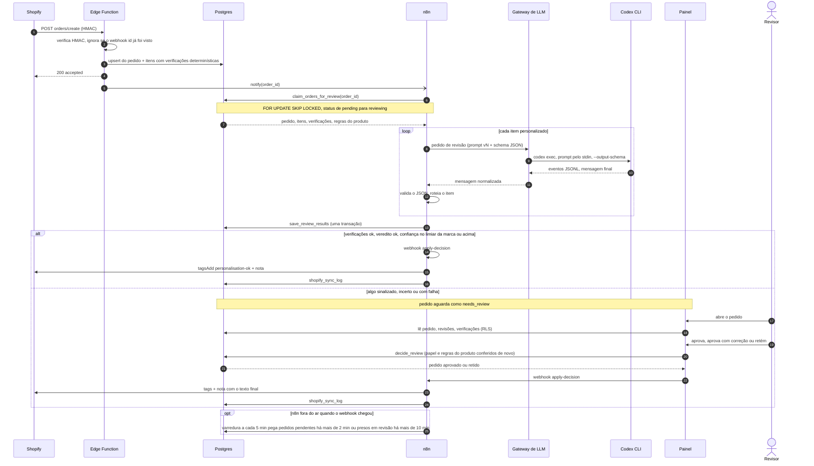
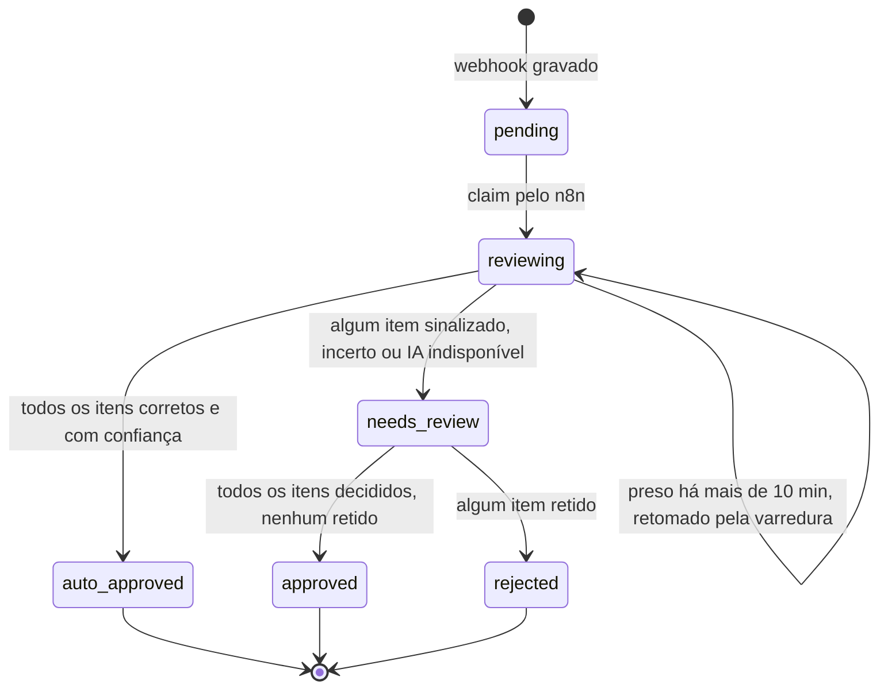

# Order Ops Copilot

🌐 [English](README.md) · **Português**

**Revisão com IA de pedidos personalizados do Shopify, com um humano no circuito só onde importa.**

Um varejista D2C multimarca vende produtos personalizados feitos sob encomenda (gravação, impressão, bordado). Cada pedido traz um texto livre digitado pelo cliente, e um erro de digitação, um emoji numa gravação ou uma frase ofensiva que chega à produção é prejuízo total: a peça não pode ser revendida. O Order Ops Copilot revisa **automaticamente, em segundos, todo pedido personalizado**, aprova sozinho os que estão corretos e envia só os sinalizados, cada um com uma correção sugerida e um rascunho de mensagem para o cliente, para um painel de operações.

> Construído de forma AI-native com Claude Code, de um [documento de design técnico](docs/TDD.md) até a implementação, os testes e a avaliação. A camada de LLM não depende de provedor: por padrão roda no **Codex CLI** (login da conta ChatGPT, sem chave de API paga), e a Messages API do Claude é uma alternativa direta.

## Demo online

**https://order-ops-copilot.vercel.app** · login `demo@order-ops-copilot.dev` · senha `!UserTest30`

A conta demo é revisora nas três marcas. A demo online roda o painel na Vercel e no Supabase (Londres) com pedidos que a IA revisou de verdade: 2 aprovados automaticamente e 5 aguardando uma pessoa, incluindo a tentativa de injeção de prompt. Os dados da demo são resetados de tempos em tempos.

A terceira marca, **Order Ops Demo Store**, é uma [loja de desenvolvimento real do Shopify](#loja-de-desenvolvimento-real-do-shopify): os pedidos chegam pelo webhook `orders/create` de verdade, e a decisão tomada na demo grava tags e nota no pedido pela Admin API. O pipeline de IA (n8n, gateway de LLM e Codex CLI) roda na máquina do autor, atrás de um túnel, então o ciclo com a loja real funciona enquanto ela está ligada; fora disso, a decisão é salva e o painel avisa que o Shopify não foi atualizado.

| Fila de revisão | Correção sugerida pela IA |
|---|---|
|  |  |
| **Injeção de prompt barrada pelas duas camadas** | **Revisor restrito a uma marca (RLS), tema escuro** |
|  |  |

> As telas estão em inglês porque o produto foi pensado para uma operação no Reino Unido.

---

## Destaques

- **Cerca de 10 s por item, do webhook à decisão:** Shopify `orders/create` → Supabase Edge Function (HMAC verificado, idempotente) → workflow n8n → LLM → Postgres → painel.
- **Regras duras no código, julgamento no modelo.** Limite de caracteres, conjunto de caracteres permitido, emoji e padrões de injeção de prompt são verificações determinísticas que o modelo não pode anular. O modelo cuida de erros de digitação, datas impossíveis, palavrões, marcas registradas e tom.
- **Falha segura por construção.** Qualquer falha da IA (recusa, timeout, JSON inválido, baixa confiança) manda o item para uma pessoa com o veredito `unavailable`. Nada é aprovado automaticamente na dúvida.
- **Prompts versionados e avaliados.** 24 casos rotulados, e um prompt só entra se o recall de sinalização continuar em 100% e as aprovações automáticas indevidas em 0. A avaliação encontrou uma brecha real de injeção de prompt na v1, corrigida na v2 (veja o [histórico de avaliação](docs/EVALS.md)).
- **Row Level Security entre marcas.** Revisores só veem e decidem pedidos das próprias marcas. As decisões passam por uma função `SECURITY DEFINER` que confere de novo, no servidor, o papel do usuário e as regras do produto. Coberto por testes de integração que fazem login como usuários reais.
- **Workflows gerados a partir do código.** O JSON do n8n é gerado pelos mesmos módulos que os testes e a avaliação exercitam, então o prompt avaliado é o prompt que roda.

## Arquitetura



| Componente | Responsabilidade | Por que fica ali |
|---|---|---|
| **Edge Function** | Verifica o HMAC sobre o corpo bruto, deduplica por `X-Shopify-Webhook-Id`, roda as verificações determinísticas e persiste | O Shopify exige resposta em até 5 s e reenvia em caso de falha. Persistir primeiro garante que nenhum pedido se perde se o n8n ou o LLM estiverem fora. |
| **n8n** | Orquestração: claim, chamada ao LLM, retentativas, roteamento, write-back e tratamento de erros | A operação vê cada execução, pode reexecutá-la e mudar ramificações sem deploy. |
| **Gateway de LLM** | Um contrato estável na frente de qualquer provedor | O n8n roda em container, enquanto o Codex CLI e o login dele ficam no host. Trocar de provedor é uma variável de ambiente, não uma mudança de workflow. |
| **Postgres + RLS** | Fonte da verdade e controle de acesso | Uma única camada de políticas protege o painel, a API e o que vier depois. Funções atômicas tornam cada passo do workflow tudo-ou-nada. |
| **Painel** | Revisão humana | Só tem a chave publicável e age com o JWT do usuário logado. Nunca vê a `service_role`. |

### Workflows do n8n

Os dois workflows são gerados a partir do código (`npm run workflows`) e importados por linha de comando.

**Revisar pedido:** duas entradas (o webhook da Edge Function e uma varredura de pendentes a cada 5 minutos) seguem pelo mesmo caminho: claim atômico, uma requisição ao LLM por item com 3 retentativas, validação e roteamento, gravação em uma transação e, no fim, o write-back no Shopify ou o registro da falha.


**Aplicar decisão no Shopify:** busca o pedido decidido, monta as tags e a nota (incluindo o texto corrigido pelo revisor, se houver) e chama a Admin API do Shopify em modo live, ou uma simulação em desenvolvimento. Nos dois casos, registra o resultado.


Um terceiro workflow, **Tratar erros**, é configurado como workflow de erro dos dois e grava cada falha em `workflow_errors`.

## Ciclo de vida do pedido



### Status do pedido



## Design da IA

| Camada | O que faz |
|---|---|
| **Verificações determinísticas** (`supabase/functions/_shared/checks.ts`) | Limite de caracteres por produto (contado em code points), charset permitido por técnica, detecção de emoji incluindo seletores de variação e sequências ZWJ, espaços e texto dirigido ao revisor ou ao sistema. Uma verificação reprovada nunca é aprovada automaticamente. |
| **Prompt** (`prompts/personalisation-review.v2.md`) | Veredito `ok`, `fix` ou `reject`, problemas específicos, correção sugerida para cada campo, confiança e rascunho de mensagem ao cliente em inglês britânico. A personalização é delimitada como dado e declarada incapaz de mudar a tarefa. |
| **Contrato de saída** (`prompts/review-schema.json`) | Schema JSON estrito, imposto pelo provedor (`--output-schema` no Codex, structured outputs no Claude) e validado de novo no workflow. |
| **Roteamento** (`lib/review-logic.ts`) | Só aprova automaticamente quando as verificações passaram, o veredito é `ok` e a confiança atinge o limiar da marca. Um item sinalizado segura o pedido inteiro. |
| **Provedor** (`lib/llm-provider.ts`) | `codex` (padrão): `codex exec` headless com sandbox read-only num diretório temporário vazio, config e rules da máquina ignoradas, execução efêmera, JSONL em que `turn.failed` é falha mesmo com exit 0, e modelo reserva quando há recusa por plano ou limite. Modelo padrão `gpt-5.6-luna` (tarefa curta e de volume), reserva `gpt-5.6-terra`. `anthropic`: Messages API do Claude pelo SDK oficial. |

**Avaliação.** O `npm run eval` passa o conjunto rotulado pela mesma requisição e pelo mesmo provedor da produção e mede o acerto exato, a precisão e o recall de sinalização, e as métricas de rota que importam na operação: **aprovações automáticas indevidas** (precisam ser 0) e revisões humanas desnecessárias.

| Prompt | Casos | Acerto exato | Recall de sinalização | Aprovações automáticas indevidas |
|---|---|---|---|---|
| v1 | 22 | 95% | 92% | 1 (injeção de prompt) |
| v2 + verificação de injeção | 24 | 100% | 100% | 0 |

Detalhes em [docs/EVALS.md](docs/EVALS.md) (em inglês).

## Segurança e confiabilidade

- **HMAC do Shopify** verificado em tempo constante sobre o corpo bruto. Assinatura inválida recebe `401` e nada é gravado.
- **Idempotência** pelo webhook id. Reentregas voltam como `duplicate`, e os upserts nunca reiniciam o status de um pedido.
- **Persistir primeiro, notificar depois.** A varredura a cada 5 minutos recupera pedidos se o n8n estava fora e retoma execuções que morreram no meio da revisão.
- **Retentativas** (3, com espera crescente) no LLM e na gravação no banco. Depois disso o item vai com segurança para uma pessoa, e o erro é gravado em `workflow_errors` por um workflow de erros dedicado.
- **Segredos** só no `.env`, nas credenciais do n8n e nos secrets das Edge Functions. Os webhooks do n8n e o gateway de LLM exigem segredo compartilhado, comparado em tempo constante.
- **RLS em todas as tabelas.** As funções do workflow só podem ser executadas pela `service_role`. A `decide_review` confere de novo o papel do revisor, recusa aprovar texto que viola as regras do produto e recusa edições acima do limite de caracteres.

## Stack

**Linguagem:** TypeScript de ponta a ponta, em modo estrito (`noUncheckedIndexedAccess`, `erasableSyntaxOnly`). O Node 24 executa os arquivos direto, por type stripping, sem etapa de build. Os Code nodes do n8n recebem a mesma lógica, com os tipos removidos na geração.

As versões são as usadas para construir e validar o projeto (setembro de 2026).

### Runtimes e infraestrutura

| Tecnologia | Versão | Papel |
|---|---|---|
| [Node.js](https://nodejs.org) | 24.21 (mínimo 22.18) | Scripts, gateway de LLM, testes; executa `.ts` direto |
| [TypeScript](https://www.typescriptlang.org) | 7.0 (raiz), 5.9 (painel) | Tipagem estrita em todo o código, só sintaxe apagável |
| [Deno](https://deno.com) | 2.9 | Runtime da Edge Function, `deno check` e `deno test` |
| [Docker](https://www.docker.com) + Compose | 29.6 + Compose 5.3 | Supabase local e n8n |
| CLI do [Supabase](https://supabase.com) | 2.118 | Stack local, migrations, deploy de funções, secrets |
| [PostgreSQL](https://www.postgresql.org) | 17.6 (Supabase) | Dados, Row Level Security, funções do workflow |
| [n8n](https://n8n.io) | 2.40 (imagem Docker) | Orquestração; workflows gerados por código |
| Agente do [ngrok](https://ngrok.com) | 3.37 | Túnel com domínio fixo que expõe só os webhooks do n8n |
| [Vercel](https://vercel.com) | região `lhr1` | Hospedagem do painel, ao lado do Supabase em Londres |

### IA

| Tecnologia | Versão | Papel |
|---|---|---|
| [Codex CLI](https://github.com/openai/codex) | 0.155 | Provedor padrão, headless, com login da conta ChatGPT |
| Modelos via Codex | `gpt-5.6-luna` (principal), `gpt-5.6-terra` (reserva) | Revisão da personalização com schema JSON estrito |
| [SDK TypeScript da Anthropic](https://github.com/anthropics/anthropic-sdk-typescript) | 0.128 | Provedor alternativo (`LLM_PROVEDOR=anthropic`) |
| Modelo via Anthropic | `claude-opus-5` | Mesmo prompt e schema do caminho Codex |

### Shopify

| Tecnologia | Versão | Papel |
|---|---|---|
| Admin GraphQL API | `2026-07` | `orderCreate`, `tagsAdd`, `orderUpdate`, assinaturas de webhook |
| Webhooks | `orders/create`, API `2026-07` | Entrada de pedidos, assinados com HMAC-SHA256 |
| App do Dev Dashboard | client credentials grant | Token de acesso de 24 h, sem OAuth interativo |

### Painel

| Tecnologia | Versão | Papel |
|---|---|---|
| [Next.js](https://nextjs.org) | 16.3 | App Router, Server Actions, `proxy.ts` |
| [React](https://react.dev) | 19.2 | Interface |
| [Tailwind CSS](https://tailwindcss.com) | 4.3 | Estilos, temas claro e escuro |
| [supabase-js](https://github.com/supabase/supabase-js) + [@supabase/ssr](https://github.com/supabase/ssr) | 2.117 + 0.12 | Auth e consultas sob RLS (só a chave publicável) |
| [ESLint](https://eslint.org) | 9.39 | Lint (`eslint-config-next`) |

### Qualidade

| Tecnologia | Versão | Papel |
|---|---|---|
| Test runner do Node | embutido no Node 24 | Testes unitários (`lib/`) e de integração do RLS |
| Deno test | embutido no Deno 2.9 | Verificações determinísticas e HMAC |
| Conjunto de avaliação do LLM | 24 casos rotulados | Portão do prompt: não pode regredir (veja [EVALS](docs/EVALS.md)) |
| [Playwright](https://playwright.dev) | 1.63 | Capturas de tela do README |

### Contas e serviços

- **Shopify:** organização de parceiro com uma loja de desenvolvimento e um app no Dev Dashboard (gratuito).
- **Supabase:** um projeto para a demo online (o plano gratuito basta); a stack local não exige conta.
- **Vercel:** hospedagem do painel (plano Hobby).
- **ngrok:** conta gratuita; o domínio dev estático mantém a URL do túnel fixa.
- **LLM:** uma conta ChatGPT logada no Codex CLI ou uma chave da API da Anthropic com crédito.

## Rodando localmente

Pré-requisitos: Docker, Node 22+, Deno e o [Codex CLI](https://github.com/openai/codex) com login feito uma vez (`codex`).

```bash
npm install && npm install --prefix web
npx supabase start          # Postgres, Auth, Edge runtime; aplica migrations + seed
npm run setup               # gera .env, web/.env.local, env das functions e credenciais do n8n
npm run functions:serve     # endpoint do webhook do Shopify (deixe rodando)
npm run gateway             # gateway de LLM na porta 8787 (deixe rodando)
npm run n8n:up && npm run n8n:import
npm run seed:usuarios       # usuários de demonstração (só local)
npm run web                 # painel em http://localhost:3000
npm run simular -- all      # envia os pedidos de exemplo do Shopify
```

Usuários de demonstração: `ops@demo.test` (admin nas duas marcas), `reviewer@demo.test` (revisor na Engrave & Co) e `viewer@demo.test` (somente leitura na Little Stitch). A senha, válida só no ambiente local, está em `scripts/demo-config.ts`.

| Comando | Para quê |
|---|---|
| `npm test` | Typecheck (`tsc` + `deno check`) e testes unitários (Node + Deno) |
| `npm run typecheck` | Só o typecheck |
| `npm run test:integration` | RLS e regras de decisão contra o Supabase local |
| `npm run eval` | Avaliação do prompt (uma chamada real ao LLM por caso) |
| `npm run workflows` | Regenera `n8n/workflows/` a partir de `lib/` e `prompts/` |
| `npm run simular -- <fixture> [--novo-id] [--duplicar] [--hmac-invalido]` | Simulador de webhooks assinados |
| `npm run shopify -- verificar \| webhook <url> \| webhooks \| pedido <fixture\|all>` | Loja de desenvolvimento real: confere o acesso, registra `orders/create`, cria pedidos de teste |
| `npm run n8n:alvo -- <local\|nuvem>` | Aponta o n8n para o Supabase local ou para o projeto da demo online |
| `npm run tunel` | Expõe só os dois webhooks do n8n pelo ngrok (domínio fixo) |

Para usar o Claude em vez do Codex, defina `LLM_PROVEDOR=anthropic` e `ANTHROPIC_API_KEY` no `.env` e reinicie o gateway.

## Loja de desenvolvimento real do Shopify

Além do simulador de webhooks assinados, o pipeline roda contra uma loja de desenvolvimento real (`order-ops-copilot-demo.myshopify.com`) e um app criado no Dev Dashboard do Shopify:

1. **Token de acesso:** o app e a loja são da mesma organização, então o token sai do *client credentials grant* (client ID + secret, sem OAuth interativo). Ele vale 24 h, por isso nada de longa duração fica guardado: o workflow de write-back pede um token novo a cada execução.
2. **Webhook:** `npm run shopify -- webhook <url>` assina `orders/create` na Edge Function do projeto online. O Shopify assina com o client secret do app, o único valor de que a função precisa.
3. **Dados protegidos de clientes:** o app declara só o mínimo (dados do pedido e o nome do cliente, do qual o revisor vê o primeiro nome). E-mail, telefone e endereço não são pedidos, então nem chegam ao sistema.
4. **Pedidos de teste:** `npm run shopify -- pedido <fixture|all>` cria pedidos de teste reais a partir das mesmas fixtures do simulador, com a personalização em line item properties.
5. **Ciclo completo:** `npm run n8n:alvo -- nuvem` aponta o n8n local para o projeto online, e `npm run tunel` expõe só `POST /webhook/review-order` e `POST /webhook/apply-decision` (uma traffic policy do ngrok responde 404 para o editor e a API do n8n; os webhooks continuam exigindo o segredo compartilhado). `SHOPIFY_MODE=live` vale só para `SHOPIFY_STORE_DOMAIN`; as marcas fictícias seguem em modo simulado.

Validado de ponta a ponta: o pedido #1001 ("Happy Anniversery") foi criado na loja, revisado pela IA (`fix`, 0,99, "Anniversary"), aprovado no painel online e recebeu no Shopify as tags `personalisation-ok` e `human-reviewed`, além da nota.

## Estrutura do projeto

```
docs/                 TDD, histórico de avaliação, capturas de tela
supabase/
  migrations/         schema, RLS, funções do workflow e de decisão
  functions/          shopify-webhook + verificações e HMAC compartilhados (Deno)
lib/                  requisição de revisão, roteamento, provedor de LLM (fonte única para o n8n e o eval)
services/             gateway de LLM
prompts/              prompts versionados + schema de saída
n8n/                  docker-compose + workflows gerados
evals/                casos rotulados
fixtures/shopify/     payloads realistas de orders/create
scripts/              setup, gerador de workflows, simulador, eval, seeds, capturas
tests/                testes de integração de RLS
web/                  painel Next.js
```

> Comentários de código e mensagens de commit estão em português do Brasil. O produto e a interface estão em inglês, e a documentação técnica (TDD e avaliação) também.

## Limitações conhecidas e próximos passos

- **Reenvio do write-back:** uma decisão tomada com o pipeline fora do ar fica salva, mas a atualização no Shopify ainda não é reenviada automaticamente. Uma varredura de pedidos decididos sem sync bem-sucedido fecharia essa lacuna.
- **Ordem dos campos:** a personalização é gravada como objeto `jsonb`, e o Postgres reordena as chaves. Ela deveria virar uma lista ordenada de `{name, value}`, formato que o resto do pipeline já usa.
- **Limites por produto** vêm de uma tabela estática por SKU (`product_rules`). Uma versão futura deve lê-los dos metafields do Shopify.
- **Pipeline completo online:** o painel, o banco e o endpoint de webhooks já estão no ar, e o pipeline de IA os atende a partir da máquina do autor por um túnel (veja [Loja de desenvolvimento real do Shopify](#loja-de-desenvolvimento-real-do-shopify)). Deixá-lo sempre ligado exige o n8n e o gateway de LLM num host pequeno, com um provedor hospedado no lugar do login pessoal do Codex.
- **Métricas:** p95 do tempo até a revisão e taxa de aprovação automática por marca, a partir dos dados já gravados.

## Autor

**Samuel Dantas**, engenheiro de software full stack · [GitHub](https://github.com/SamukDantas) · [LinkedIn](https://linkedin.com/in/samuel-dantas-3a10882b4)
