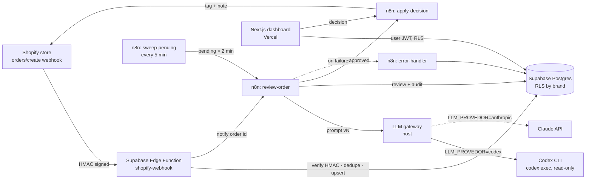
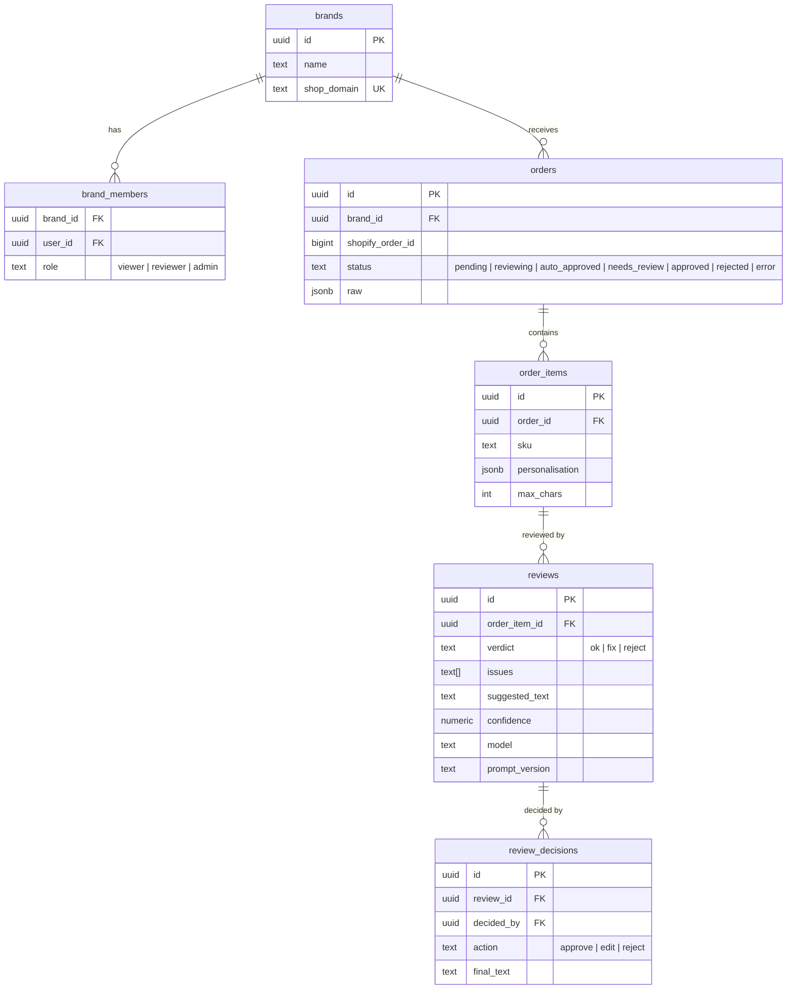

# Technical Design Document: Order Ops Copilot

| | |
|---|---|
| **Author** | Samuel Dantas |
| **Status** | Approved for build (v1) |
| **Date** | 2026-09-26 |
| **Stack** | Shopify · Supabase (Postgres, RLS, Edge Functions) · n8n · LLM gateway (Codex CLI or Claude API) · Next.js on Vercel |

---

## 1. Problem

A multi-brand D2C business sells **personalised products** (engraved gifts, custom prints, embroidered clothing). Every order carries free-text personalisation typed by the customer. Today someone on the operations team reads each one before it goes to production, looking for:

- typos and inconsistent capitalisation ("happy birthdya", "MUM" vs "Mum"),
- text that exceeds the product's character limit or uses unsupported characters (emoji on an engraving),
- offensive or trademarked content,
- mismatches between the personalisation and the order (a child's name on an adult product, a date in the future for a "Est." print).

Mistakes are expensive: a personalised item cannot be resold, so every production error is a full write-off plus a reshipment.

## 2. Goals and non-goals

**Goals**

1. Review **100% of personalised orders automatically** within 1 minute of order creation.
2. Auto-approve clean orders; send only flagged ones to a human.
3. Give the ops team a **dashboard** to approve, edit or reject flagged items, and write the decision back to Shopify (order tag + note).
4. Support **multiple brands**, where each team member sees only the brands they work on.
5. Make every AI decision **auditable**: prompt version, model, input, output and reviewer are all stored.

**Non-goals (v1)**

- Changing the order in Shopify beyond tags and notes (no line-item edits).
- Contacting customers automatically (drafted replies only; sending stays human).
- Fraud scoring beyond simple signals.

## 3. Success metrics

| Metric | Target |
|---|---|
| Orders reviewed automatically | 100% of orders with personalisation |
| Time from order to review | p95 < 60 s |
| Share of orders needing a human | < 20% |
| Flag precision on the evaluation set | ≥ 90% |
| Lost reviews (webhook received, never reviewed) | 0, enforced by the sweep job |

## 4. Architecture

### Why this split

| Component | Responsibility | Reason |
|---|---|---|
| **Edge Function** | Receive the webhook, verify the HMAC, deduplicate, persist | Shopify requires a 200 response within 5 s and retries on failure. Persisting first means nothing is lost even if n8n or Claude is down. |
| **n8n** | Orchestration: AI call, branching, retries, write-back to Shopify | The business team can see the flow, retry runs and change branching without a deploy. |
| **Postgres + RLS** | Source of truth and access control | One policy layer protects the dashboard, the API and any future tool. |
| **Next.js dashboard** | Human-in-the-loop review | Holds no privileged keys: it acts with the signed-in user's JWT, so RLS applies. |

## 5. Data model

Additional tables: `webhook_events` (idempotency via `X-Shopify-Webhook-Id`) and `workflow_errors` (failures captured by the n8n error workflow).

### Row Level Security

| Table | Policy |
|---|---|
| `brands`, `orders`, `order_items`, `reviews` | `SELECT` only when `auth.uid()` is a member of the row's brand |
| `review_decisions` | `INSERT` only by members with role `reviewer` or `admin` on the brand, and `decided_by = auth.uid()` |
| `webhook_events`, `workflow_errors` | No policies: `service_role` only |

The Edge Function and n8n use the `service_role` key server-side. The browser never holds it.

## 6. AI design

- **Provider behind a gateway.** n8n never talks to a model vendor directly: it posts the review request to a small gateway on the host (`services/llm-gateway.mjs`), which answers in one normalised, Messages-API-shaped format whatever the provider is. `LLM_PROVEDOR` picks the provider:
  - `codex` (default): the Codex CLI in headless mode (`codex exec`) on the ChatGPT account login, following the same method as the internal `squad-engenharia` project: read-only sandbox in an empty temp dir, machine config and rules ignored, ephemeral, JSONL output where `turn.failed` counts as failure even on exit 0, prompt on stdin, JSON schema enforced with `--output-schema`, and a fallback model when the primary one is refused for plan, limit or capacity reasons. Default model: `gpt-5.6-luna`, suited to short, high-volume tasks, with `gpt-5.6-terra` as the fallback.
  - `anthropic`: the Claude Messages API through the official SDK (`claude-opus-5`, structured outputs, server-side refusal fallback). Needs an API key with credit.
  Switching provider changes an environment variable, not the workflow.
- **Output contract:** a single JSON object validated in n8n before anything is written:
  `{ verdict: "ok" | "fix" | "reject", issues: string[], suggested_text: string | null, confidence: 0..1, customer_message: string | null }`
- **Prompts are versioned files** in `prompts/` (e.g. `personalisation-review.v1.md`). The version is stored with every review.
- **Deterministic checks run first** (character limit, allowed character set). The model gets their results as context and never overrides a hard limit.
- **Fail safe:** invalid JSON, a timeout, or `confidence < 0.7` all route the item to `needs_review`. Uncertainty always reaches a human.
- **Evaluation set:** `prompts/evals/*.json` holds labelled cases (typos, emoji, profanity, over-limit, clean). `npm run eval` reports precision and recall per prompt version. A prompt change ships only if it does not regress the evaluation set.

## 7. Reliability and error handling

| Failure | Handling |
|---|---|
| Duplicate webhook | Unique `webhook_id`; returns 200 without reprocessing |
| Invalid HMAC | 401, nothing stored |
| n8n unreachable | Order stays `pending`; `sweep-pending` picks it up within 5 minutes |
| LLM error or timeout (provider or gateway) | n8n retries 3 times with backoff; then the item is stored with verdict `unavailable`, the order goes to `needs_review` and a `workflow_errors` row is written |
| Invalid model output | Treated as low confidence, routed to `needs_review` |
| Shopify write-back fails | Retried; the failure is logged in `workflow_errors` |

## 8. Security

- Shopify HMAC verified with a constant-time comparison over the raw body.
- Secrets (Shopify, LLM gateway, `service_role`) live only in Edge Function secrets, n8n credentials and the host `.env`. The gateway requires a shared secret and compares it in constant time.
- The n8n webhooks require a shared secret header.
- The dashboard uses Supabase Auth, and every query goes through RLS.
- PII is minimised: only the customer's first name and the order fields needed for review are stored in structured columns.

## 9. Delivery plan

| Sprint | Scope |
|---|---|
| 1 | Schema + RLS, Edge Function, Shopify webhook simulator, TDD |
| 2 | n8n workflows (review, sweep, apply-decision, error handler), prompt v1 + evaluation set |
| 3 | Dashboard (auth, brand filter, review queue, decisions), deploy on Vercel |
| 4 | Real Shopify development store, metrics, hardening |

## 10. Open questions

- Per-product character limits: read from product metafields (v2) or keep a static SKU map (v1)?
- Should auto-approval thresholds differ per brand?
