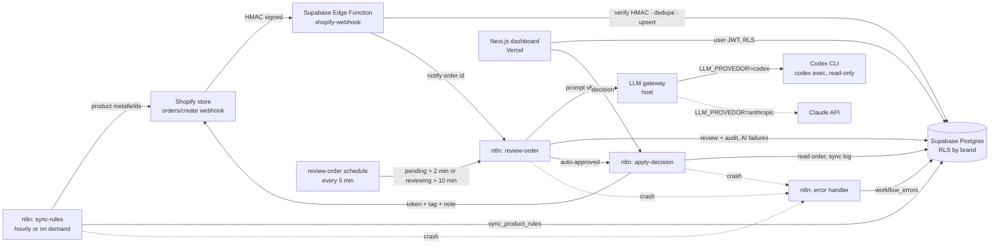
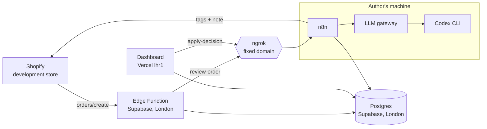
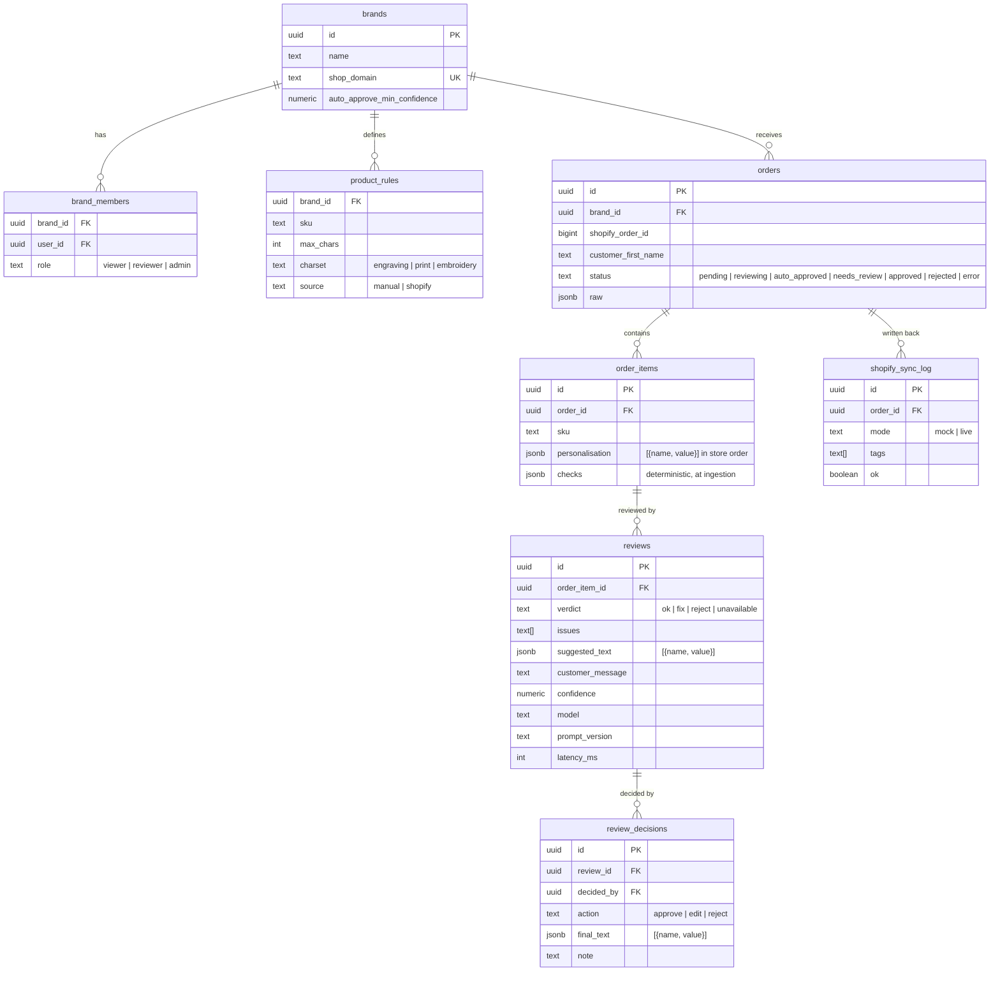

# Technical Design Document: Order Ops Copilot

| | |
|---|---|
| **Author** | Samuel Dantas |
| **Status** | Implemented. Running against a real Shopify development store (prompt v2) |
| **Date** | 2026-09-26 · last updated 2026-09-27 |
| **Stack** | Shopify · Supabase (Postgres, RLS, Edge Functions) · n8n · LLM gateway (Codex CLI or Claude API) · Next.js on Vercel · ngrok |

---

## 1. Problem

A multi-brand D2C business sells **personalised products** (engraved gifts, custom prints, embroidered clothing). Every order carries free-text personalisation typed by the customer. Today someone on the operations team reads each one before it goes to production, looking for:

- typos and inconsistent capitalisation ("happy birthdya", "MUM" vs "Mum"),
- text that exceeds the product's character limit or uses unsupported characters (emoji on an engraving),
- offensive or trademarked content,
- mismatches between the personalisation and the order (a child's name on an adult product, a date in the future for a "Est." print).

Mistakes are expensive: a personalised item cannot be resold, so every production error is a full write-off plus a reshipment.

## 2. Goals and non-goals

**Goals**

1. Review **100% of personalised orders automatically** within 1 minute of order creation.
2. Auto-approve clean orders; send only flagged ones to a human.
3. Give the ops team a **dashboard** to approve, edit or reject flagged items, and write the decision back to Shopify (order tag + note).
4. Support **multiple brands**, where each team member sees only the brands they work on.
5. Make every AI decision **auditable**: prompt version, model, input, output and reviewer are all stored.

**Non-goals (v1)**

- Changing the order in Shopify beyond tags and notes (no line-item edits).
- Contacting customers automatically (drafted replies only; sending stays human).
- Fraud scoring beyond simple signals.

## 3. Success metrics

| Metric | Target |
|---|---|
| Orders reviewed automatically | 100% of orders with personalisation |
| Time from order to review | p95 < 60 s |
| Share of orders needing a human | < 20% |
| Flag precision on the evaluation set | ≥ 90% |
| Lost reviews (webhook received, never reviewed) | 0, enforced by the sweep job |

The second and third metrics are tracked per brand on the dashboard's Metrics page (`brand_metrics`, a `SECURITY INVOKER` function, so RLS limits each person to their brands), together with the time from AI review to human decision and the number of decisions waiting for a Shopify sync. Time to review is measured from the persisted webhook to the first AI review.

## 4. Architecture

### Why this split

| Component | Responsibility | Reason |
|---|---|---|
| **Edge Function** | Receive the webhook, verify the HMAC, deduplicate, persist | Shopify requires a 200 response within 5 s and retries on failure. Persisting first means nothing is lost even if n8n or the LLM is down. |
| **n8n** | Orchestration: AI call, branching, retries, write-back to Shopify, product rules sync | The business team can see the flow, retry runs and change branching without a deploy. |
| **Postgres + RLS** | Source of truth and access control | One policy layer protects the dashboard, the API and any future tool. |
| **Next.js dashboard** | Human-in-the-loop review | Holds no privileged keys: it acts with the signed-in user's JWT, so RLS applies. |

### Deployment

The same code runs in two setups:

- **Local:** Supabase, the Edge Function and n8n in Docker, the gateway and the Codex CLI on the host, and the signed-webhook simulator (`npm run simular`) playing the store.
- **Online demo:** the dashboard on Vercel and the database and Edge Function on Supabase (both in London), connected to a real development store (`order-ops-copilot-demo.myshopify.com`). The AI pipeline still runs on the author's machine: `npm run n8n:alvo -- nuvem` points n8n at the online database, and `npm run tunel` exposes only the two n8n webhooks through ngrok.

When the machine is off, orders still arrive and are stored as `pending` (the sweep reviews them once n8n is back), and decisions are saved; their Shopify write-back is applied by the sync sweep once n8n is back (see §7).

## 5. Data model

Additional tables: `webhook_events` (idempotency via `X-Shopify-Webhook-Id`) and `workflow_errors` (failures captured by the n8n error workflow).

The `error` order status is accepted by the schema but not produced today: an AI failure routes the order to `needs_review` (see §6), so it always reaches a person.

`product_rules` has two sources. `manual` rows are written by hand (the fictional brands in the seed). `shopify` rows come from the store: the n8n workflow "Sincronizar regras do Shopify" reads the `order_ops.max_chars` and `order_ops.charset` metafields (product, overridden by variant) every hour and calls `sync_product_rules` (`service_role` only), which in one transaction upserts them by SKU, replacing a manual rule for the same SKU, and removes `shopify` rows that left the store. Invalid metafields are skipped and logged to `workflow_errors`; an invalid rule in the payload aborts the whole sync, so the table is never half-updated. The Edge Function reads only `product_rules`, so ingestion does not depend on the Admin API.

### Row Level Security

| Table | Policy |
|---|---|
| `brands`, `product_rules`, `orders`, `order_items`, `reviews`, `shopify_sync_log` | `SELECT` only when `auth.uid()` is a member of the row's brand |
| `review_decisions` | `SELECT` for brand members; `INSERT` only by members with role `reviewer` or `admin` on the brand, and `decided_by = auth.uid()`. The dashboard decides through `decide_review`, which checks the role again and refuses text that breaks the product rules |
| `webhook_events`, `workflow_errors` | No policies: `service_role` only |

The Edge Function and n8n use the `service_role` key server-side. The browser never holds it. The workflow functions (`claim_orders_for_review`, `save_review_results`) can only be executed by `service_role`.

## 6. AI design

- **Provider behind a gateway.** n8n never talks to a model vendor directly: it posts the review request to a small gateway on the host (`services/llm-gateway.ts`), which answers in one normalised, Messages-API-shaped format whatever the provider is. `LLM_PROVEDOR` picks the provider:
  - `codex` (default): the Codex CLI in headless mode (`codex exec`) on the ChatGPT account login, following the same method as the internal `squad-engenharia` project: read-only sandbox in an empty temp dir, machine config and rules ignored, ephemeral, JSONL output where `turn.failed` counts as failure even on exit 0, prompt on stdin, JSON schema enforced with `--output-schema`, and a fallback model when the primary one is refused for plan, limit or capacity reasons. Default model: `gpt-5.6-luna`, suited to short, high-volume tasks, with `gpt-5.6-terra` as the fallback.
  - `anthropic`: the Claude Messages API through the official SDK (`claude-opus-5`, structured outputs, server-side refusal fallback). Needs an API key with credit.
  Switching provider changes an environment variable, not the workflow.
- **Output contract** (`prompts/review-schema.json`): a single JSON object validated in n8n before anything is written:
  `{ verdict: "ok" | "fix" | "reject", issues: string[], suggested_text: {name, value}[] | null, confidence: 0..1, customer_message: string | null }`
- **Prompts are versioned files** in `prompts/` (currently `personalisation-review.v2.md`). The version is stored with every review.
- **Deterministic checks run first** (character limit and charset per SKU, emoji, whitespace, text addressed to the reviewer or the system). The model gets their results as context and never overrides a hard limit: a failed check is never auto-approved.
- **Fail safe:** invalid JSON, a timeout, a refusal, or a confidence below the brand threshold (`auto_approve_min_confidence`, never below 0.7) all route the item to `needs_review`. Uncertainty always reaches a human.
- **Evaluation set:** `evals/cases.json` holds 24 labelled cases (typos, emoji, profanity, over-limit, prompt injection, clean). `npm run eval` reports exact accuracy, flag precision and recall, and unsafe auto-approvals after full routing. A prompt change ships only if it does not regress the set; see [EVALS.md](EVALS.md).

## 7. Reliability and error handling

| Failure | Handling |
|---|---|
| Duplicate webhook | Unique `webhook_id`; returns 200 without reprocessing |
| Invalid HMAC | 401, nothing stored |
| n8n unreachable | Order stays `pending`; `sweep-pending` picks it up within 5 minutes |
| LLM error or timeout (provider or gateway) | n8n retries 3 times with backoff; then the item is stored with verdict `unavailable`, the order goes to `needs_review` and a `workflow_errors` row is written |
| Invalid model output | Treated as low confidence, routed to `needs_review` |
| Shopify write-back fails | Retried 3 times (token request and GraphQL call); the result is logged in `shopify_sync_log` and failures in `workflow_errors` |
| Rules sync fails (Shopify unreachable, invalid metafield) | The last synced rules stay in `product_rules`, so ingestion keeps checking limits. Token and GraphQL calls retry 3 times; an invalid metafield is skipped and logged to `workflow_errors`; `sync_product_rules` is all-or-nothing, so the table is never half-updated |
| Pipeline offline when a decision is taken, or the write-back failed | The decision is saved. A 5-minute sweep in `apply-decision` calls `orders_pending_sync` (decided orders with no successful sync since the decision, older than 2 min) and applies them again. Shopify failures are logged with `ok = false` (only the error message, never the request) and the sweep gives up after 5 of them |

## 8. Security

- Shopify HMAC verified with a constant-time comparison over the raw body.
- **Shopify access:** the app and the development store belong to the same organization, so the Admin API token comes from the client credentials grant. It lasts 24 h and is requested on every write-back instead of being stored. Only `SHOPIFY_STORE_DOMAIN` runs in live mode; other brands stay in mock. Scopes: `read_orders`, `write_orders`, `read_products` and `write_products`; the last one is used only by `npm run shopify -- catalogo` to create the demo products and metafield definitions, and the pipeline itself only reads products.
- **Protected customer data:** the app declares only order data and the customer's name. Email, phone and address are not requested.
- Secrets (Shopify client secret, LLM gateway, `service_role`) live only in Edge Function secrets, n8n credentials, the host `.env` and Vercel's sensitive environment variables. The gateway requires a shared secret and compares it in constant time.
- The n8n webhooks require a shared secret header. When exposed through the tunnel, an ngrok traffic policy lets only `POST` to the two webhooks through; the n8n editor and API return 404.
- The dashboard uses Supabase Auth, and every query goes through RLS.
- PII is minimised: only the customer's first name and the order fields needed for review are stored in structured columns.

## 9. Delivery plan

| Sprint | Scope | Status |
|---|---|---|
| 1 | Schema + RLS, Edge Function, Shopify webhook simulator, TDD | Done |
| 2 | n8n workflows (review, sweep, apply-decision, error handler), prompt v1 + evaluation set | Done (prompt v2 after the evaluation found a prompt-injection gap) |
| 3 | Dashboard (auth, brand filter, review queue, decisions), deploy on Vercel | Done |
| 4 | Real Shopify development store, metrics, hardening | Store, write-back retry, metrics page and rules from metafields done and verified end to end |

## 10. Decisions and open questions

**Decided**

- Per-product character limits live in `product_rules`, read at ingestion. For a real store they come from product metafields (`order_ops.max_chars`, `order_ops.charset`) through an hourly sync, not a live Admin API call per order: the webhook stays fast and keeps working when Shopify is slow. The cost is up to an hour of delay after the merchant edits a limit (the sync can also be triggered on demand).
- Auto-approval thresholds differ per brand (`brands.auto_approve_min_confidence`), with 0.7 as a floor.
- LLM provider: Codex CLI by default, Claude Messages API as a drop-in alternative behind the same gateway.
- Personalisation is stored as an ordered list of `{name, value}` in the order of the Shopify line item properties (a `jsonb` object would reorder the keys, and on an engraving the line order matters). A check constraint keeps it a list.

**Open**

- Where to host n8n and the gateway for an always-on pipeline, and which hosted model provider replaces the personal Codex login there.
